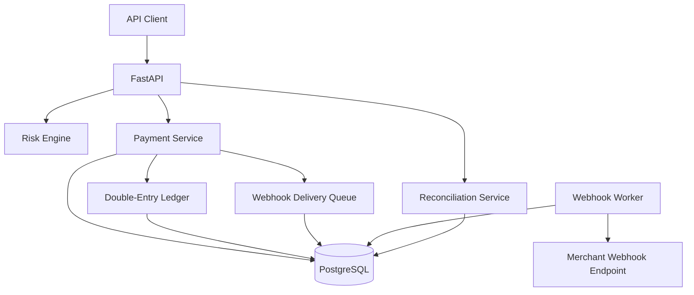

# PayFlow

[](https://github.com/Sunnez/Payflow/actions/workflows/ci.yml)

A backend-focused FinTech payment processing platform built with Python, FastAPI and PostgreSQL.

PayFlow demonstrates core payment-system concepts including idempotent payment creation, payment lifecycle management, double-entry accounting, refunds, risk assessment, reconciliation and reliable webhook delivery.

> This is a portfolio and educational project designed to demonstrate backend and FinTech engineering concepts. It is not intended for processing real payments.

## Features

### Payment Processing

* Merchant creation
* Payment creation
* Payment lifecycle management
* Authorization and capture
* Failed payments
* Full refunds

Payment lifecycle:

```text
PENDING
   |
   +---- authorize ----> AUTHORIZED ---- capture ----> CAPTURED ---- refund ----> REFUNDED
   |
   +---- fail ---------> FAILED
```

### Idempotency

Payment creation supports an `Idempotency-Key` HTTP header.

Repeated requests with the same merchant, key and payload return the existing payment instead of creating a duplicate.

The implementation includes:

* Composite database uniqueness constraint
* SHA-256 request fingerprinting
* Conflict detection for reused keys with different payloads
* Race-condition protection at the database level

### Double-Entry Ledger

Captured payments create an immutable financial ledger transaction.

Example:

```text
Capture €25.00

Processor Clearing     DEBIT     2500
Merchant Payable       CREDIT    2500
```

Refunds create compensating entries instead of modifying historical ledger entries:

```text
Refund €25.00

Merchant Payable       DEBIT     2500
Processor Clearing     CREDIT    2500
```

Every financial operation is performed atomically inside a database transaction.

### Concurrency Protection

Payment state transitions use PostgreSQL row locking with `SELECT ... FOR UPDATE`.

This prevents concurrent requests from processing the same financial transition multiple times.

### Risk Engine

Payments receive a rule-based risk assessment during creation.

Example rules include:

* Large transaction amount
* Very large transaction amount
* Newly created merchant
* High payment velocity
* Unusual currency

Payments receive:

```json
{
  "risk_score": 45,
  "risk_level": "medium",
  "risk_reasons": [
    "Large transaction",
    "Merchant created less than 24 hours ago"
  ]
}
```

High-risk payments require manual review and cannot be automatically authorized.

### Webhooks

Merchants can register webhook endpoints.

Supported events include:

```text
payment.authorized
payment.captured
payment.failed
payment.refunded
```

Webhook delivery includes:

* Database-backed delivery queue
* Separate asynchronous worker
* HMAC-SHA256 signatures
* Retry scheduling
* Delivery attempt tracking
* Failed-delivery state

External HTTP calls are performed outside financial database transactions.

### Reconciliation

PayFlow can compare payment records with a CSV report received from an external payment service provider.

Supported reconciliation results:

```text
MATCHED
MISSING
AMOUNT_MISMATCH
CURRENCY_MISMATCH
STATUS_MISMATCH
```

Example input:

```csv
payment_id,amount,currency,status
550e8400-e29b-41d4-a716-446655440000,2500,EUR,captured
```

## Architecture



## Tech Stack

**Backend**

* Python 3.13
* FastAPI
* Pydantic

**Database**

* PostgreSQL
* SQLAlchemy
* Alembic

**Infrastructure**

* Docker
* Docker Compose
* GitHub Actions

**Testing & Quality**

* pytest
* pytest-asyncio
* HTTPX
* Ruff

## Project Structure

```text
payflow/
├── alembic/
├── app/
│   ├── api/
│   │   └── routes/
│   ├── core/
│   ├── db/
│   ├── models/
│   ├── schemas/
│   ├── services/
│   ├── workers/
│   └── main.py
├── tests/
├── .github/
│   └── workflows/
├── Dockerfile
├── docker-compose.yml
├── pyproject.toml
├── requirements.txt
└── README.md
```

## Running the Project

Clone the repository and create the environment file:

```bash
cp .env.example .env
```

On Windows PowerShell:

```powershell
Copy-Item .env.example .env
```

Build and run the application:

```bash
docker compose up --build
```

The API will be available at:

```text
http://localhost:8000
```

Swagger documentation:

```text
http://localhost:8000/docs
```

Health endpoint:

```text
http://localhost:8000/health
```

The webhook worker starts automatically as a separate Docker Compose service.

## Example Payment Flow

Create merchant:

```http
POST /merchants
```

Create payment:

```http
POST /payments
Idempotency-Key: order-123
```

```json
{
  "merchant_id": "MERCHANT_UUID",
  "amount": 2500,
  "currency": "EUR"
}
```

Authorize:

```http
POST /payments/{payment_id}/authorize
```

Capture:

```http
POST /payments/{payment_id}/capture
```

Refund:

```http
POST /payments/{payment_id}/refund
```

## Testing

Create the test database once when running tests locally:

```bash
docker exec -it payflow-postgres psql -U payflow -d postgres -c "CREATE DATABASE payflow_test;"
```

Run the complete integration test suite:

```bash
pytest -v
```

Tests cover:

* Payment creation
* Idempotency
* Idempotency conflicts
* Payment lifecycle
* Invalid state transitions
* Balanced double-entry ledger
* Duplicate capture protection
* Refund accounting
* Duplicate refund protection
* Transaction rollback
* Reconciliation
* Risk assessment

## Code Quality

Run Ruff:

```bash
ruff check .
ruff format --check .
```

Automatic fixes and formatting:

```bash
ruff check . --fix
ruff format .
```

## CI

GitHub Actions automatically runs:

```text
Ruff lint
Ruff formatting check
Alembic migration validation
Integration tests
```

on pushes and pull requests.

## Key Engineering Concepts Demonstrated

* REST API design
* Asynchronous Python
* PostgreSQL transactions
* Database migrations
* Idempotency
* Race-condition handling
* Row-level locking
* State machines
* Double-entry accounting
* Atomic financial operations
* Compensating transactions
* Webhook reliability
* HMAC signatures
* Retry mechanisms
* Payment reconciliation
* Rule-based risk assessment
* Integration testing
* Dockerized development
* Continuous integration
